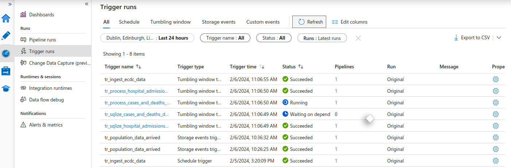

# Production Ready Pipelines

## Data Orchestration Requirements
- Pipeline executions are fully automated
- Pipeline runs at regular intervals on an event occurring
- Activities only run once the upstream dependency is satisfied
- Easy monitoring for execution progress and issues

## Data Factory Capability
 - Dependency between activities inside a pipeline
 - Dependency between pipelines with a parent pipeline
 - Dependency between triggers (only tumbling window triggers)
 - Custom-made solution to execute pipelines from sdk (powershell, .net, python, rest api)

## Data Orchestration - Option 1 - Parent Pipeline
- Parent pipeline will execute the ingestion and transformation pipelines for the population data. Trigger will execute the pipeline as soon as the file arrives in the storage account
- Pipeline uses Execute Pipeline activity to invoke process population data on success of the ingest population data (dependency)
- Storage events trigger executes the pipeline automatically when a new file (blob created) is added to the azure blob storage account

- Parent pipeline to execute ingest and process (databricks) pipelines using on success dependency

- trigger runs shows execution based on storage events trigger

## Data Orchestration - Option 2 - Trigger Dependency (tumbling window triggers)

- Tumbling window triggers are a type of trigger that fires at a periodic time interval from a specified start time, while retaining state
- Trigger to process the ingest ecdc data pipeline
- 3 Triggers for the processing of data (transformation) which are dependent on the ingestion pipeline
- 3 Triggers for the sqlize (copy data to sql db) which are dependent on each of the corresponding processing pipeline triggers
- Tumbling window triggers allow adding of dependency triggers, the triggers are set to run at 00:00:00 every 24 hours meaning daily slices of data will be ingested, processed, and sqlized automatically
- Trigger options:
  - dependency offset of -1 allows processing yesterdays ingested data today
  - window size is the size of the dependency tumbling window

- tumbling window triggers used to create dependencies between pipelines

- trigger runs show process (transformation) pipelines running on success of ingestion trigger run

- as process trigger runs, sqlize trigger run is waiting on success dependency

- all trigger runs succeeded and pipelines have been executed on success dependencies
