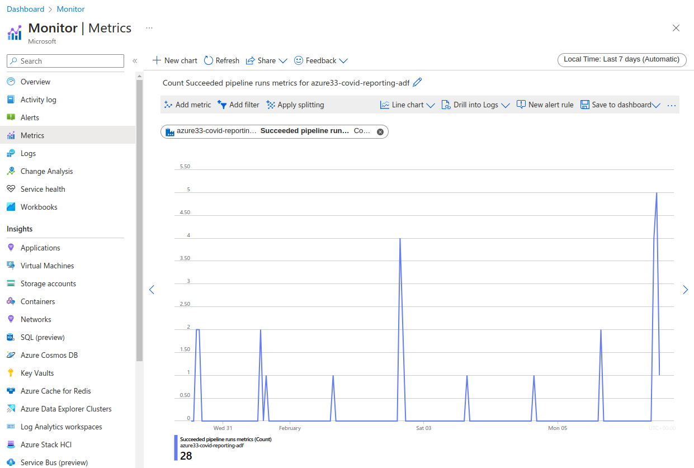

# Azure Data Factory - Monitoring

## What to monitor?
- Azure Data Factory Resource (managed service on serverless architecture)
- Integration runtime
- Trigger runs
- Pipeline runs
- Activity runs

## Data Factory Monitor
- Monitor status of pipeline or triggers  
- Re run failed pipelines or triggers
- Send alerts from base level metrics
- Provides base level metrics and logs
- Pipeline runs only stored for 45 days

## Azure Monitor
- Route the diagnostic data to other storage solutions such a storage accounts, log analytic, event hub, or partner solution (store logs for any time period required)
- Provides richer diagnostic data
- Write complex queries and custom reporting
- Report across multiple data factories

- Azure metric

- Reporting on Metrics - monitoring Dashboard

## Azure Monitor for applications and infrastructure
- Monitor - Diagnostic settings allow sending metrics and log data to destination such as log analytics workspace, storage account, or event hub
- To maintain existing retention rules, migrate to Azure Storage Lifecycle Management
- Send log files to storage account to retain logs for more than 45 days

## Log Analytics
- Create log analytics workspace and set destination for metrics and logs
- Destination resource specific means logs and metrics stored in table for each specific resource
- In log analytics workspace, query logs and metrics using Kusto query language
  - query counts, join triggers to pipeline runs, view status of pipeline runs at each stage

  - query trigger runs

  - query count

  - query to summarises latest status trigger runs from log analytics
  - summarise max time generated (latest data) by trigger id and project data
  - join trigger run to projected data as latestADFTriggerRun variable
  - join on triggerid and time generated
  - summarize counts by status and project status and count
  - render as pi chart

  - query to summarise trigger counts by trigger name

  - workbook for reporting

# Azure Data Factory Analytics
- create from marketplace and attach log analytics workspace
- workbooks created by Azure for our data factory
- Edit queries as required
