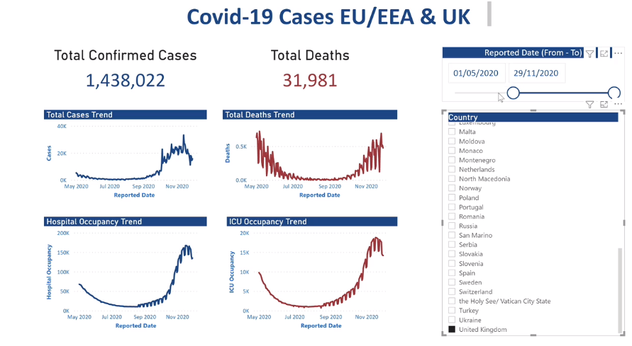
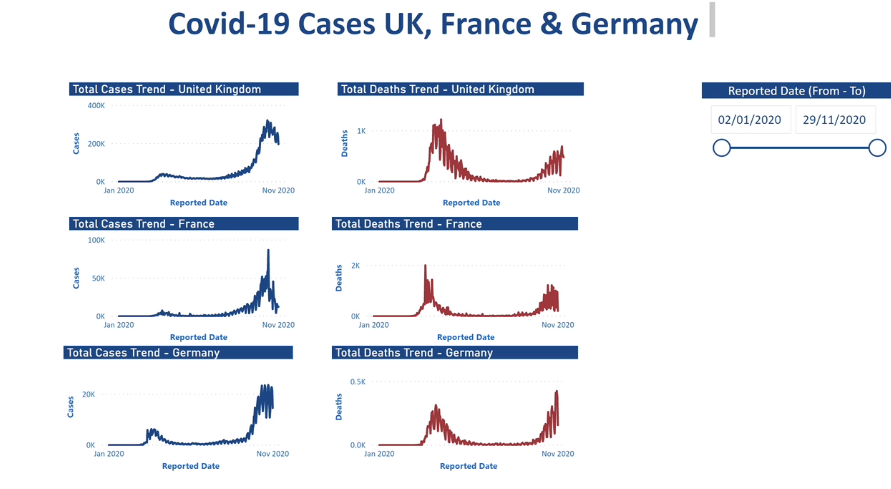
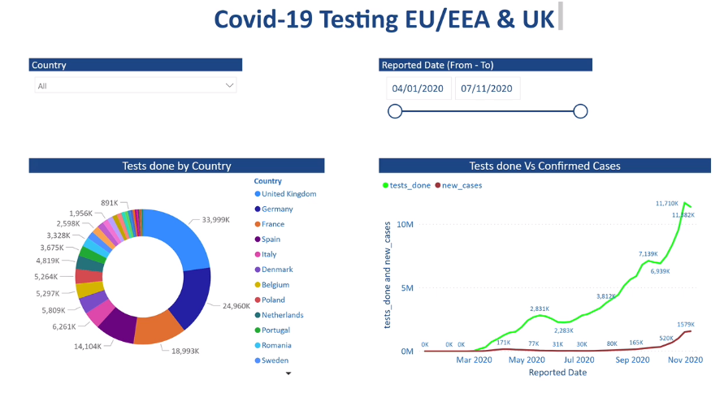

# Power BI

## Power BI Desktop
- Get Data from Azure SQL database and connect using server and database details and credentials
- configure data source settings
- set SQL Server database details
- Edit permissions and enter credentials

## Covid-19 Trends - EU/EEA & UK

## Covid-19 Trends by Country - UK, FRANCE & GERMANY

## Covid-19 Testing Trends - Test Done by Country & Confirmed Cases

