# Continuous Integration / Continuous Deliver - CI / CD

## CI / CD DevOps

- DevOps is the intersection of software development (dev) and operations (ops)
- Benefits of DevOps include higher quality of software, faster speed of delivery to market, adapting to changing markets, rapid delivery, reliability, scale, improved collaboration, security

## DevOps Characteristics
- collaboration, trust, and transparency
- agile development approach
- Continuous integration / delivery
- automation
- continuos improvement

## CI / CD - ADF

## CI / CD Option 1 - Using ADF Publish
- Live Mode - directly connect the ADF - Studio to the ADF - Repo (not suitable for industry projects with multiple developers)
- Git Mode - connect ADF - Studio to Git (supports GitHub or Azure Devops Repos) allows feature branches and main branch, merge branches to main to publish to ADF - Dev repo and also creates adf_publish branch containing ARM Templates
- Manual process for the build element of the CI
- Automated deployment for the CD

## Azure DevOps
Azure DevOps is an end-to-end software development platform that offers capabilities to organize and accelerate development efforts across the entire application lifecycle
- SaaS platform
  - Boards (Kanban, agile and scrum)
  - Repos (source control to manage code - git)
  - Pipelines (build and release services to support CI/CD)
  - Test Plans (planned manual testing, user acceptance testing, exploratory testing, stakeholder feedback and response)
  - Artefacts (library service to store packages or development artefacts to be shared within a CI/CD pipeline)

## Azure Data Factory Set-Up

- 3 ADF's with 3 separate resource groups required for project

## ADF Git Configuration
- In Azure DevOps Repos, create dev branch and set branch policies for requiring min number of reviewers
- In Azure Data Factory Studio, for dev data factory, configure a repository and specify Azure DevOps organisation name, repo name, branches, and root folder for JSON imports

## ADF Code Development using Git - Continuous Integration - Code

- Create feature branch for dev adf
- Implement pipeline on feature branch
- Publish is only available in main branch so use save all to save in the git repository in feature branch
- Create pull request and add reviewers for approval of changes
- Complete pull request, merge branch to main branch, complete work items after merging, delete feature branch after merging, customise merge commit message
- Create new branch for dev adf to update pipeline
- Implement pipeline changes and save to commit to Git
- View and compare changes in Azure DevOps Repo commits, create pull request, add reviewers, complete merge

## Option 1 - Manual Build - Continuous Integration - Build

- In dev adf, Publish to publish branch adf_publish to push resource to adf repo
- This generates ARM Template and ARM Template Parameters JSON files and saves to Git
- The purpose of the ARM Template Parameters For Factory JSON is to change parameter value when deploying to other environments

## Option 1 - Release Pipeline Design - Continuous Delivery

- Release pipeline:
  - ARM template is deployed to ADF - Test
  - On successful deployment it sends an approval request for deployment to production
  - Once approved, the release pipeline deploys ARM template to ADF - Prod

- Azure DevOps provides a job called ARM Deployment
- Test Stage:
  - Deployment via ARM Deployment can only add or update artefacts, deleted artefacts such as pipeline will have no effect
  - Deployment via ARM Deployment fails if we try to update a data factory trigger that is active in the Test ADF
  - Deployment script (written in PowerShell job) stops triggers before deployment and starts triggers once deployment completes and handles deleted objects
- Prod Stage
  - Production Stage is used to deploy to Production
  - Requires approval and waits for Test Deployment to complete

## Option 1 - Creating ARM Deployment Task - Continuous Delivery - Release Pipeline

- In Azure DevOps, create release pipeline which deploys ARM Template to ADF - Test using ARM Deployment Job
- Enable Releases under the Pipeline Menu in Organization Settings

- Artefact:
  - source type Azure Repo Git
  - Select source repo
  - default branch is adf_publish
  - Add artefact
- Test Stage
  - Add Arm Deployment Task
  - Arm template deployment
  - Deployment scope is Resource Group
  - Create Azure Resource Manager connection by selecting Azure subscription
  - In a production environment, best practice is to restrict access to specific resource groups
  - Authorize drop down Advanced options allow Service Principal Authentication where you can select test resource group which contains ADF - Test
  - This creates a new service principal with contributor role within the test resource group. Therefore pipeline has privileges to deploy ARM Template into this resource group
  - In Azure portal, for the test resource group, the Access Control IAM role assignments show the Contributor role. This means the resource connection and service principal only has access to the required test resource group

  
  - Action - Create or update resource group as we want to add ARM Template as an update
  - Specify test resource group and location
  - Specify Template location as Linked artefact
  - Select ARMTemplateForFactory.json
  - Select ARMTemplateParametersForFactory.json
  - Override template parameters - the ARM Parameter json file has factoryName set to dev, we want to override this as we want to deploy to the test area
  - Best practice is to use variables for data factory names, locations, and resource group names which is advantageous for copying pipelines for different environments
  - Deployment mode: Incremental
- Deployment modes:
  - Incremental - Takes objects / resources from the ARM Template and updates within the resource group (in this case, takes info about the data factory and updates the resource group with the data factory information)
  - Complete - Deletes every resource within the resource group and applies the ARM template to that resource group (for example, if we have a data lake, key vault an data factory within a rg, complete deletes all resources. As the ARM Template only has information about the data factory, it will only apply the data factory)
  - Validation only - Validates ARM Template information and syntax errors
- Continuous deployment - when adf_publish branch is updated, run release pipeline to release test data factory, Click Trigger, and Enable Continuous deployment trigger, and add branch filter as adf_publish

## Option 1 - Testing ARM Deployment Task

Test ARM Deployment using Manual Release:
- Create release (manual release) to deploy dev data factory to test data factory
- Requires hosted parallelism

- View job - ARM Template Deployment Task succeeded
- View logs to ensure clean deployment
- In ADF - Test, pipeline from ADF - Dev has been deployed

Test ARM Deployment is using Continuous Deployment
- In ADF - Dev, create a new feature branch to test release pipeline
- In feature branch (test), create a new pipeline, Debug and Save All to Git repository
- Create pull request, assign reviewers, approve pull request and complete pull request merge changes from feature to main branch
- In main branch, Publish new pipeline - Published to collaboration branch and generated ARM Templates
- In Azure DevOps, Pipeline Release-2 has completed

- Continuous Deployment - change in the ADF - Dev has triggered Release Pipeline to run
- View job - ARM Template Deployment Task succeeded and logs show clean deployment
- ADF - Test has been updated and contains the new pipeline
- Testing of release pipeline shows correct implementation of continuous deployment

## Option 1 - Pitfalls of the  ARM Deployment Task - Release Pipeline - Issues
- Release pipeline does not handle Deleted Objects - Deleting a pipeline in the Dev - ADF will not be applied on deployment to Test - ADF or Prod - ADF
- Cannot update Active Triggers as it will fail during deployment

Demonstrating Option 1 Release Pipeline Issues:
- In ADF - Dev, create a new feature branch and delete pipeline_2
- create new tumbling window trigger and attach to pipeline_1
- create pull request, inspect changes, add reviewer, and approve / merge feature branch to main
- Switch to main branch and Publish
- In Azure DevOps, Release-3 has run and ARM Template deployment has completed

- In ADF - Test, pipeline_1 and deleted pipeline_2 still exist as ARM deployment does not Delete Object
- In ADF - Test, trigger that was attached to pipeline_1 has been deployed to ADF - Test. By default deployed triggers are not started (require manual start)
- Now In ADF - Dev, create new branch and update trigger by updating end date
- create pull request, inspect change and merge feature branch to main
- Switch to main branch and Publish
- In Azure DevOps, Release-4 has run and ARM Template deployment has Failed (Cannot update enabled trigger: The trigger needs to be disable first)

- error message

## Option 1 - Pre and Post Deployment Task- Release Pipeline
- Azure Data Factory Repo Continuous Integration and Delivery has Sample pre- and post- deployment script (Use the PrePostDeploymentScript.Ver2.ps1 to turn off/ on only the triggers that have been modified in Dev instead of turning all triggers off/ on during CI/CD which is more efficient)
- Specify Script execution parameters
- In Azure Devops, add PrePostDeploymentScript to main rather than adf_publish branch which is managed by ADF
- In Branches, create new feature branch, add a folder for release pipeline, upload PrePostDeploymentScript file and commit.
- Create pull request, review, and complete pull request to merge to main
- Edit release pipeline and Add Artefact, source type is Azure Repo, source repo is ADF - Dev and default branch is main as it contains the script
- In Test Stage, Add Job Azure PowerShell
- Set Pre Deployment Script File Path
- Set Pre Deployment Arguments
  - armTemplate
  - ResourceGroupName (test resource group)
  - data-factory-name (test adf)
  - predeployment true
  - deleteDeployment false

- specify PowerShell version

- Clone Pre Deployment Script and modify Script Arguments
  - armTemplate
  - ResourceGroupName (test resource group)
  - data-factory-name (test adf)
  - predeployment false
  - deleteDeployment true

- Reorder Agent Jobs / Tasks to execute Pre Deployment Script, ADF Deployment, then Post Deployment

## Option 1 - Testing ADF CD Option 1 Release Pipeline
Test by Create release pipeline or Test by triggering a change from Dev Data factory and see continuous deployment and changes

- Create new feature branch and update pipeline in ADF - Dev
- Pull request and complete merge to main
- Switch to main branch and Publish to ADF which creates adf_publish branch and ARM Templates
- In Azure DevOps, Release-6 has run and Pre Deployment, ARM Template deployment, and Post Deployment Succeeded

- In ADF - Test, updates have worked successfully
  - pipeline_1 exists and pipeline_2 deletion has been applied as expected
  - trigger is now deployed in started state as it is started by the Post Deployment Script, and trigger has been updated as end date change has been appied
- ADF CD Option 1 Release Pipeline has fixed the issues mentioned regarding handling deletion of objects and deploying trigger changes for triggers in active state

## Option 1 - Pipeline Variables
- In Azure DevOps, the release pipeline Tasks have hard-coded resource group, location, data factory name and script argument inputs
- Use Variables to copy Tasks and Release pipelines when creating a stage for Production
- Variable options:
  - Use Pipeline variables
  - Variable groups

- Specify Pipleine variables and values and set the scope

- Change hard-coded values to variable names in each Release Pipeline Task using $()

- Test Release using Manual Create Release which is Release-7

## Option 1 - Add Production Stage - Release Pipeline - Deployment to Prod
- Create a Prod Stage with the same Task that points to ADF - Prod
- Prod pipeline execution waits for an approval process
- Clone Test Stage and rename to Prod Stage
- Update variable names, values and scope

- For ARM Template Deployment Task, Azure Resource Manager connection only has access to test resource group
- Identify service principal name
- Access control of Prod resource group and add role assignment Contributor
- Assign access to user group or service principal and select service principal name
- Service principal now has Contributor role access to the Prod resource group meaning service connection in Azure DevOps can now deploy to Prod resource group

- Set Pre-deployment condition as we do not want continuous deployment through to Production
- Enable Pre deployment approvals and add Approvers for deployment

## Option 1 - Test Release Pipeline through to Production Stage - Deployment to Prod
- In ADF - Dev create new branch and implement pipeline_3
- Pull request and complete merge to main
- Publish changes to start continuous deployment via adf_publish and ARM Template
- In Azure DevOps, Release-8 exists with Test and Prod Stages

- Test Stage has succeeded
- Prod Stage is pending approval

- ADF - Test data factory has pipeline_3 as expected showing Test stage is correctly implemented  
- Email is sent to approver for approval to Production
- Approve (if tests pass) to queue and execute Prod Stage

- Prod Stage has succeeded
- Release-8 shows both Test and Prod Stages succeeded

- ADF - Prod data factory has both pipelines and trigger as expected
- Completed ADF CD Option 1 Release Pipeline which uses ARM Template from the adf_publish to deploy updates and changes to Test and Prod

## Option 1 - ADF Publish vs Option 2 - Build Pipeline

CI/CD Option 1 - Using ADF Publish

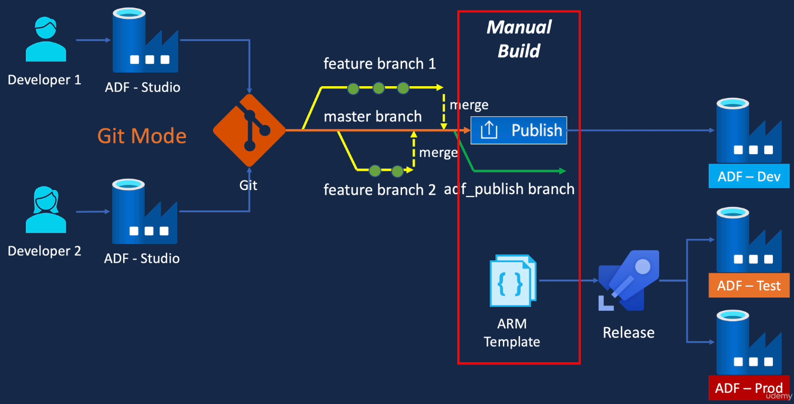

- requires Manual Build (Build Stage) as Publish in ADF is required after pull request is completed to generate ARM Template
- Publish validates data factory resources and generates the ARM Template in the adf_publish branch

CI/CD Option 2 - Using Build Pipeline

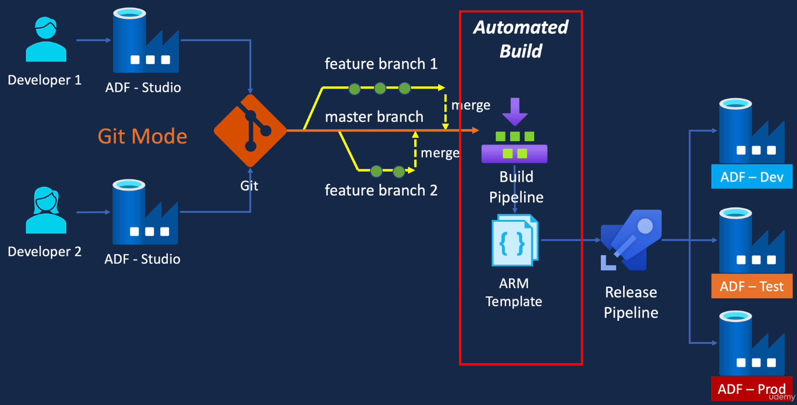

- DevOps Build Pipeline to invoke ADFUtilities Npm package
- On successful build, pipeline will create build artefact with ARM Template
- Release pipeline can be modified to consume ARM Template from build aterfact and deploy this ARM Template to ADF - Dev and then ADF - Test and ADF - Prod

- Option 2 is a fully automated CI / CD Solution

## Azure Data Factory Automated publishing for continuous integration and delivery

Current CI / CD Flow
- Current CI / CD Flow (Option 1)
  - uses Git (DevOps or GitHub)
  - create feature branches and pull request changes to merge to main
  - Manual Step - Publish in ADF to generate ARM Template and deployment to ADF - Dev
  - Release pipeline pulls Publish branch as artefact
  - Stage Test and Prod Development
  - Deploy changes to ADF - Test and ADF - Prod

New CI / CD Flow
- uses Git (DevOps or GitHub)
- create feature branches and pull request changes to merge to Collaboration branch (main)
- Automatically trigger build on commit
- DevOps build pipeline calls ADFUtilities Npm package which validates ADF resources and generates ARM Template, and creates Build
- Release pipeline pulls artefacts
from the DevOps build pipeline
- Results in automatic CI deployment to ADF Dev and Stage Deployment to ADF - Test and ADF - Prod

## Option 2 - ADF CI Build Pipeline - YAML Build Pipeline Script

- package.json
  - required to install azure-data-factory-utilities package
- adf-ci-option-2-build-pipeline.yaml
  - build pipeline for the development Azure Data Factory
  - automatically triggered on completion of a pull request and merge to main branch
  - validates the ADF resources
  - generates ARM Template and publishes for consumption via Release pipeline

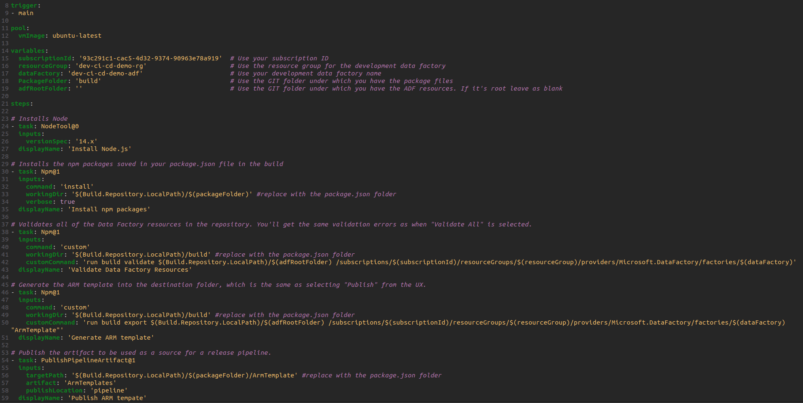

- In Azure DevOps Dev repo, create feature branch, new folder build,  upload package.json and yaml configuration file
- commit, pull request, merge to main branch

## Option 2 - ADF CI Build Pipeline - Create YAML Build Pipeline

- In Azure DevOps, Create Pipeline
- Select Azure Repos Git and dev repo
- Existing Azure Pipelines YAML file and select yaml configuration file

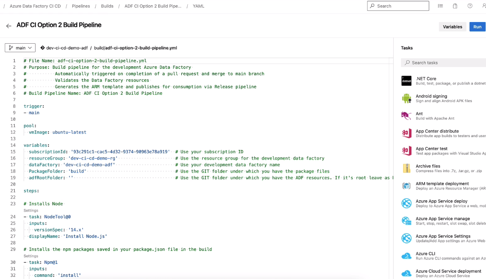

- Run Pipeline
- View Jobs in run

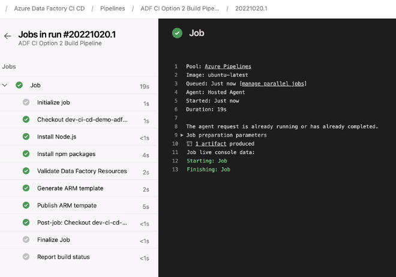

1 Artefact Published which is the ArmTemplates to be consumed from Release Pipeline

- Trigger the Pipeline by making changes to ADF - Dev
- create feature branch, implement changes to pipeline_3
- pull request and merge changes
- ADF CI Option 2 Build Pipeline automatically starts Pipeline Run

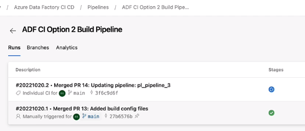

- Build of Azure Data Factory is now automated and ARM Templates are published as artefacts

## Option 2 - Update Release Pipeline

Create a Release pipeline that consumes the ARM Template published by the Build Pipeline
- Clone and create ADF CD Option 2 Release Pipeline
- Delete Artefact pointing to the adf_publish branch
- Add new artefact from source type Build
- Replace ARM Template and ARM Template Parameters location in all task (pre deployment, ARM Template deployment, post deployment) to the file paths to the Build Pipeline locations

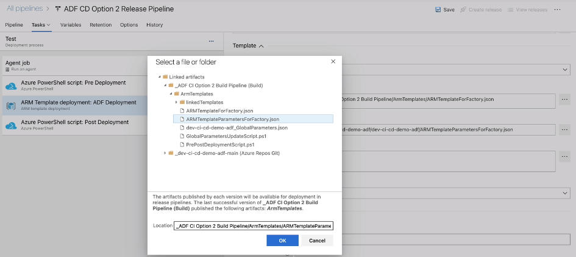

- Deploy to Dev - ADF as there is no longer a Publish which deploys changes to Dev
- Clone Test Stage and Create Dev Stage
- Edit Dev variables
- Correct order of execution

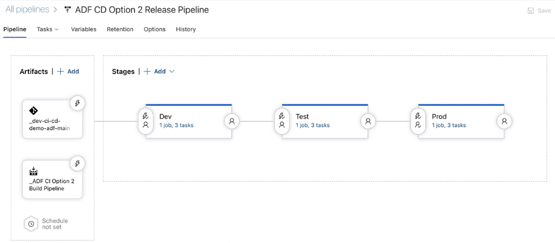

- Completed CD Option 2 Release Pipeline
- Provide access for service connection to deploy to dev resource group
- In dev resource group, access control (IAM), assign Contributor role for service principal
- Now service connection from Azure DevOps has access to the Dev resource group allowing deployment to the resource group

## Option 2 - Testing CD Option 2 Release Pipeline

- Test individual Stages using Manual Create Release
- Dev succeeded
- Test Succeeded
- Prod waiting for manual approval
- On approval, Prod succeeded

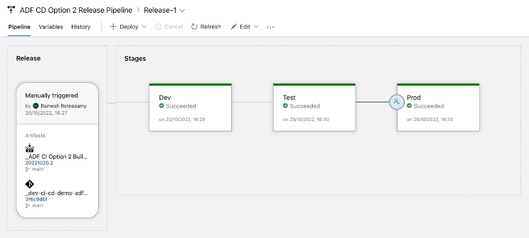

- ADF CD Option 2 Release Pipeline takes the artefact ARM Templates from the Build Pipeline and deploys to Dev - ADF, Test - ADF, and on manual approval to Prod - ADF

## Option 2 - Enable Continuos Deployment on Release Pipeline Artefact

- Enable Continuous deployment
- Build pipeline has a trigger which is triggered on any changes to main branch
- To trigger the Release pipeline as soon as the Build has completed
  - Enable continuos deployment trigger on the Build artefact

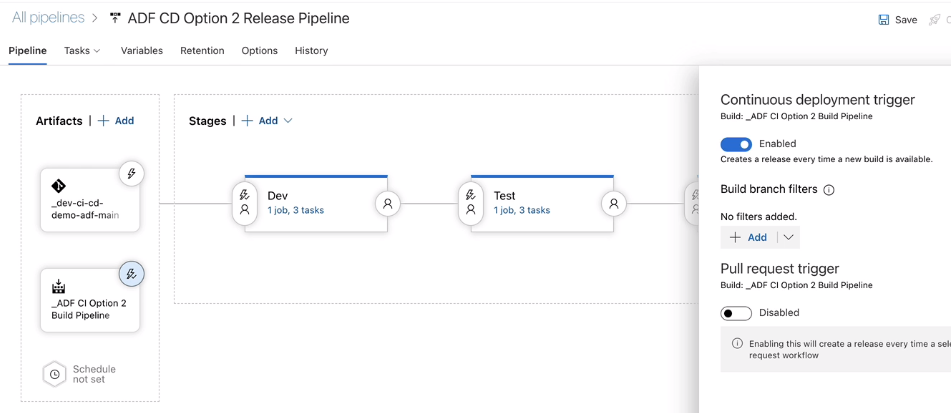

## Option 2 - CI / CD End to End Testing
- In ADF - Dev, create new feature branch
- Implement pipeline_4
- Save all and create pull request, approve changes, and complete merge to main
- On successful merge to main branch, build pipeline is triggered and run

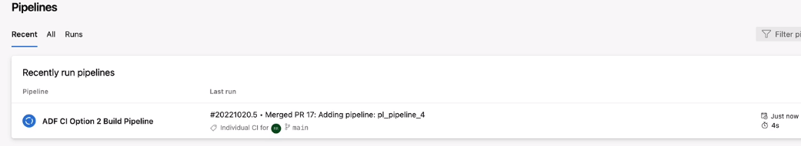

- Build is completed with 1 published artefact which contains ARM Templates
- On successful build, release pipeline is triggered with 3 stages

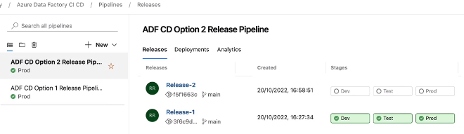

- Release pipeline Stages outcomes:
- Dev stage deployment succeeded
  - pipeline_4 exists in live mode
- Test stage deployment succeeded
  - pipeline_4 exists in live mode
- On Manual approval process, Prod stage deployment succeeded
  - pipeline_4 exists in live mode

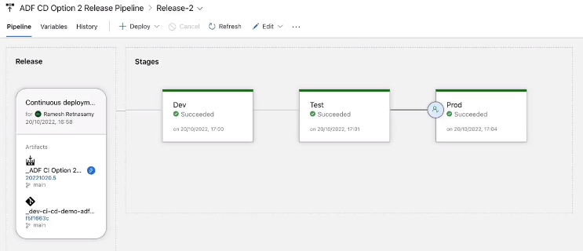

- successfully implemented Build and Release Pipeline to seamlessly deploy code from Dev to Test to Production automatically
