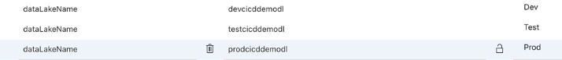

# CI / CD Scenario - Data Lake Access

## Data Lake Access in Production Scenario
- ADF Pipelines access data from many storage solutions such as Azure Data lake, SQL Database, and executing workloads on various compute engines such as Databricks, HDInsight
- Data lake required for Dev, Test, and Prod
- Data factory requires credentials to interact with the data lake storage
- ADF offers the following authentication options (use managed identity for access where possible)
  - Access Keys
  - Service Principal
  - System Assigned Managed Identity
  - User Assigned Managed Identity

- 3 Data lakes required (create storage account with hierarchical namespace)
- DL - Dev under Dev resource group
- DL - Tests under Test resource group
- DL - Pord under Prod resource group
- For each DL, create source and sink container with data uploaded to source container

## Using Managed Identity - Grant Access to Data Lake

## Data Lake Access via System Assigned Managed Identity
- Azure assigns a System assigned Managed Identity to each ADF resource
- The Managed identity needs the required role assigned to the storage account, therefore the ADF can access the storage account
- In storage account DL - Dev,
  - Access control (IAM)
  - Add Storage Blob Data Contributor role assignment
  - Assign access to Managed Identity
  - Select Members and select the Dev - ADF
  - ADF has access to the storage account (data lake gen2) via System Assigned Managed Identity
- Grant Storage Blob Data Contributor access for each Data Lake Storage Account to the corresponding ADF

## Using Managed Identity - Data Factory Pipeline
- In ADF - Dev, create a new branch
- Create new linked service for Azure Data Lake Storage Gen2, and set authentication type as System Assigned Managed Identity
- New pipeline with Copy Data Activity to copy data from source container to sink container
- For Source, create dataset for data lake storage gen2, select linked service, and specify source file in source container
- For Sink, create dataset for data lake storage gen2, select linked service, and specify desalination in sink container
- Debug to run pipeline

- Save all changes to Git
- Pull request and merge changes to main
- In Azure DevOps, the build pipeline is automatically triggered and run
- The Release pipeline is run
  - Deploy to Dev succeeded and Deploy to Test succeeded as the new pipeline is now committed to the ADF - Test, however in ADF - Test, the Debug fails as the link service points to the Dev - DL and access has not been granted to ADF - Test to access the data lake storage

## Using Managed Identity - Release Pipeline Changes
- Required to modify the Release Pipeline so when the ADF Pipelines are deployed to Dev, Test and Prod environments, they are pointing to the correct corresponding data lake storages
- From build pipeline artefacts, view ARMTemplate Parameters, linked service URL needs to be updated for each DL
- In ADF CD Option 2 Release pipeline, edit variables

- Override parameters of the linked service for Dev, Test, and Prod Stages

- Create new release to run release pipeline
- Dev, Test and Prod (on approval) succeeded
- ADF - Test has the correct test data lake linked service URL as it has been parametrized and test connection succeeds as Managed identity has been granted access to the corresponding data lake
- Debug of the pipeline runs the copy activity and in the Test - ADF, data in the source containers is copied to the sink container as expected
- On approval of the Prod Stage of the Release Pipeline, ADF - Prod link service is updated to point to the Prod - DL, Debug of the pipeline succeeds as expected

## Using Access Keys - Solution Options

## Data Lake Access via Access Keys
- Options for using access keys to authenticate to the data lake storage
  - Option 1
    - Store keys in ADF linked service (Data factory prevents storing keys in Git, and will auto publish changes and store keys in the ADF repository and Git repository values will be blank)
    - When releasing changes to ADF - Test and ADF - Prod via Git, the keys will be carried over as blank in the ARM Templates
    - Solution is to store the keys in each ADF environments within a Key Vault and modify the release pipeline to read keys from the corresponding Key Vaults, and override the ARM Template parameters with the keys

  - Option 1 Problems
    - ADF - Dev auto publishes the linked services which causes code in ADF to be out of sync with Git
    - Relying on the Release Pipeline to update the Keys to ADF - Test and ADF - Prod. As it is common practice in industry to rotate keys regularly to ensure keys are not compromised. Therefore, once keys are rotated, updating of Key Vaults are required, and an unnecessary deployment required to update keys in all environments

- Option 2
  -  ADFs retrieve keys from Key Vaults when needed rather than storing within the ADF
  - Only required to update Key Vaults when keys are rotated and ADFs retrieve new keys at run-time

## Using Access Keys - Key Vault
- Create 3 Key Vaults (one per ADF environment)
- A Key Vault access policy determines whether a given security principal, namely a user, application or user group, can perform different operations on keys, secrets and certificates
- Grant access to ADF - Dev to access Key Vault using Access Policies
- Permissions required are Get and List Secret Permissions
- Create a Secret with value which is Access Key from Dev - DL
- Create Key vault, add access policy for ADF Access and Add Secret and value from DL

## Using Access Keys - Create Data Factory Pipeline
- On feature branch, create linked service for data lake gen2 for access key option
- authentication type is account key
- account selection method is enter manual
- URL is endpoint for Data lake storage
- select from Azure Key Vault
- new linked service to the Key Vault is required in order for ADF to access it
- specify secret name
- ADF retrieves the value of the secret name and authenticates access to the storage account
- create pipeline with copy activity with new source and sink datasets
- set source file location and sink file destination for the copy
- Datasets use a linked services that access the storage account via Access Keys
- Save All and Debug to run pipeline and copy data from source to sink
- Pull request and merge changes to main

Issue:
- In ADF - Test, the Key Vault linked service is pointing to the Dev Key Vault
- Modify in the Release Pipeline by changing ARM Template parameters to override with the correct value

## Using Access Keys - Release Pipeline Changes
- Modify Release Pipeline by inspecting ARM Template Parameters json:
  - override linked service for the key vault to point to the correct storage account DL
  - override linked service for the storage account that uses access keys to point to the correct storage account DL
  - new variables for storing the key vault name

- Override template parameters for each environment

- Create new release
  - Deployments to Dev, Test, Prod succeeded
  - For each ADF, linked service for the key vault points to the correct key vault and test connection succeeds
  - For each ADF, linked service for the access key points to the correct storage account (data lake) and test connection succeeds
- Test the Release Pipeline Changes
  - In ADF - Test, Debug the pipeline to run copy activity to copy data from source to sink
  - Deployment to Dev, Test, and Prod succeeded
- Summary
  - Access keys and managed identity to access storage resources within Azure
  - Override parameter within the release pipeline using key vaults
