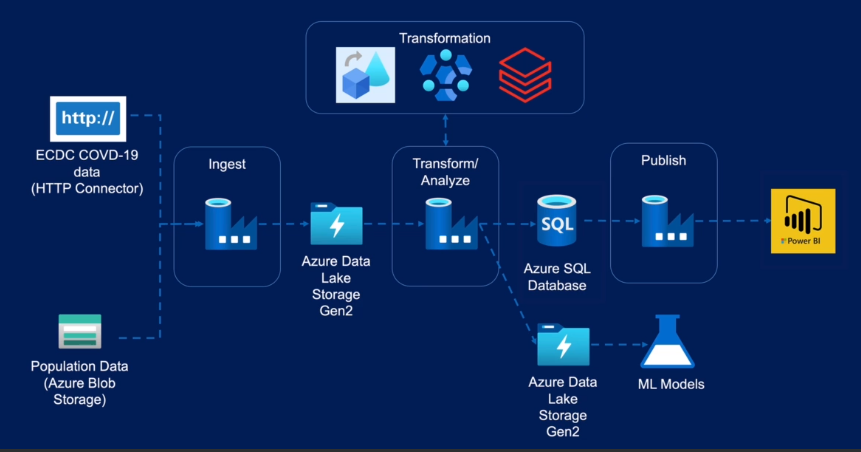

# Azure-Data-Factory Project

## Project Overview
- Covid-19 Prediction / Report
- Data platform for Data Scientist to run ML models
- Data platform for Data Analyst to run analytics using a reporting tool

## Data Lake
- Data Lake built to aid Data Scientists to predict the spread of the virus including data on confirmed cases, mortality, hospitalisation/ICU cases, testing numbers, country's population by age group

## Data Warehouse
- Data Warehouse built to aid Reporting on Trends including data on confirmed cases, mortality, hospitalisation/ICU cases, testing numbers

## Data Sources
- EODC website
- Eurostat website

## Solution Architecture
- Azure Data Factory for data integration and orchestration as it provides connectors to all our data sources in this project and connectors to expand the project in future when a new requirement arises. Data Factory has the connectors to orchestrate the workflow with running transformations in HDInsight or Databricks
-  Transformational technologies: Data Flow within Data Factory, HDInsight, and Azure Databricks.
- Data Flow is a code free transformation tool to develop simple and medium level complexity transformations
- HDInsight and Databricks, will requires code in one of Spark supported languages such as Python, Scholar or Spark SQL. HDInsight gives you the ability to write code in a SQL like language Hive and also a scripting language Pig.
- Storage Solutions: Azure Blob Storage, Azure Data Lake storage Gen 2 as the Data Lake, Azure SQL database for the data warehouse solution
- Blob Storage is optimised for storing massive amounts of unstructured data. Unstructured data is data that doesn't adhere to a particular data model or definition, such as text or binary data. Used to distribute data centrally in a business or expose data to the world.
- Azure Data Lake Storage Gen2 is a set of capabilities dedicated to big data analytics, built on Azure Blob Storage. It enables us to mount Data Lake storage to add the big data solutions such as Hadoop databases and synapse analytics.
- Azure SQL database is our data warehouse solution. Azure's synapse analytics
formally called Azure data warehouse,is a better solution
for large data warehouses due to its massively parallel processing architecture.
- Reporting technology: PowerBI

## Storage Solutions
Key factors to consider
- Structure of the data (structured, semi-structured, unstructured)
- Operational needs (how often is data accessed?, how quickly do we need to server?, need to run simple or complex queries?, need to run heavy analytical workload, accessed from multiple regions?)

## Azure Databases (structured data)
- Azure SQL Database
- Azure Database for MYSQL
- Azure Database for PostgreSQL
- Azure Database for MariaDB
- VM Images with Oracle, SQL Server etc

## Azure Storage Account
- Blob Storage (storing unstructured data such as text files, media, documents, images, pdf)
- File Storage (fully manages cloud file store accessed via SMD protocol)
- Disk Storage (storing virtual machine discs on Azure VMs)
- Table Storage (storing structured data in form of key value pairs)
- Queue Storage (storing and retrieving messages from the queue)

## Azure Data Lake (big data analytics)
- Azure Data Lake storage Gen2 (designed to service multiple petabytes of data while sustaining hundreds of gigabytes of throughput)
- Enhanced performance for big data analytics and support for Hadoop compatible workload
- Enhanced management due to hierarchical namespace
- Better Security using POSIX Permissions on folders and files
- Cost efficient - built on Blob Storage

## Azure Cosmos DB
- Fully managed NoSQL database for modern application development.
- Globally distributed allowing elastic scale throughput and storage across multiple Azure regions
- Multi-model as it supports APIs to access data such as SQL API, Cassandra, MongoDB, Gremlin API
- High throughput as it provides real time response times for a variety of data
- Use cases: web, mobile gaming  or IOT applications that need to handle massive amounts of data reads, writes, and are global scale with near real time response
