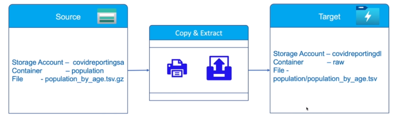
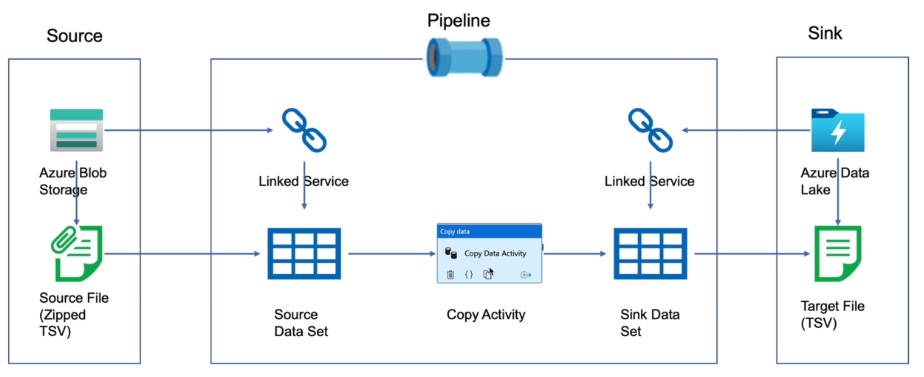
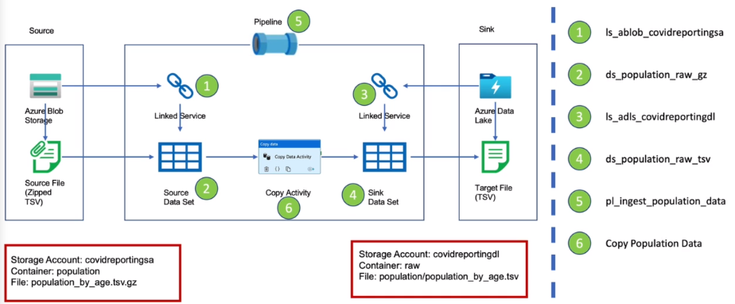

# Data Ingestion from Azure Blob

## Data Ingestion - Population Data

Data Ingestion of Eurostat data to obtain Population of each country by Age Group to Data Lake

## Copy Activity

Azure Blob Storage -> Azure Data Lake

- Higher mortality rate due to Covid in Europe has been attributed to the ageing Population
- Ingest 'population by age' for all EU countries into the Data Lake to support the machine learning models to predict increase in Covid-19 mortality rates

- Source File (Zipped TSV) type, structure, name of file
- Source Data Set and Sink Data Set
- Link services connection details to the Blob Storage and to the Data Lake
- Pipeline that executes a copy activity
- Integration, run time, triggers

## Copy Activity Environment Preparation
- Source includes Storage Account sa, Container and File to be copied across
- Sink includes Storage Account dl, Container and File copied across by the Data Factory

## Naming standards

## Control Flow Activities - Validation activity

Scenario 1:
- Copy Activity when the file becomes available
- Use the Validation Activity to Check if File exists and On success of the Validation, Executed the Copy activity

## Control Flow Activities - Get Metadata, If Condition, Web Activities

Scenario 2:
- Execute Copy Activity only if file contents are as expected before copying the data to the Data Lake
- Validation Activity to check File Exists as previous
- Use the Get Metadata Activity to obtain metadata of raw_gz file and specify Field List such as Column Count, Size, Exists, returned as a JSON output file
- Use the If Condition Activity to write an expression to check If Column Count Matches For the True Case: Copy activity and For the False Case: Web Activity to Send Email with URL and REST API method as POST for the target endpoint. This is for instances of False Case where file contents are not as expected and used to notify the user of pipeline errors in a production environment
- ADF has a Fail Activity that allows throwing of an error intentionally, configured with settings of Fail Message and Error code to Debug the pipeline

## Control Flow Activities - Delete activity

Scenario 3:
- Delete the source file on successful copy
- On Success of the Copy Activity, Delete Activity to delete the source raw_gz file on successful copy. This means when a new raw file is uploaded, it will be copied and deleted on successful copy to the Data Lake Storage
- In the Delete Activity, Select the source dataset and optionally enable logging to log the delete file names in the logging store

## ADF Triggers - Scheduling Pipeline Execution

Schedule Trigger:
- Runs on a calender/Clock
- Supports periodic and specific times
- Trigger to Pipeline is Many to Many - can attach all ingestion pipeline to one trigger to invoke all pipelines at the same specified time. Similarly can invoke the same pipeline for more than one trigger (running a database maintenance pipeline during ingestion as well as transformation by attaching maintenance pipeline to both ingestion and transformation triggers)
- Can only be scheduled for a future time to start

Tumbling Window Trigger:
- Runs at periodic intervals
- Windows are fixed sized, non-overlapping - useful to deal with slices of data (requirement to ingest data from SQL database to a data lake every hour and only want to ingest data created within that hour, attach the pipeline to the Tumbling Window Trigger which will invoke the pipeline every hour and pass the start and end time to the Copy Activity, which can used the times to fetch data for that particular slice)
- Can be scheduled for the past windows/ slices (required to get data from 9am to 10am yesterday, run the slice to fetch the data created within that time frame)
- Trigger to Pipeline is one to one

Storage Event Trigger:
- Runs pipeline in response to event
- Events can be creation of deletion of Blobs/Files
- Trigger to Pipeline is Many to Many
- A Custom Event Trigger can parse and send a custom data payload to your pipeline

## Creating Event Trigger
- Pipeline is executing copy of file from Azure Blob Storage to Azure Data Lake Storage, and source file is expected to arrive once per day in the Blob Storage, and is deleted on successful copy
- Can implement either a Schedule Trigger due to the functionality implemented in our pipeline or Storage Events Trigger as we are deleting the source file on successful copy and want to process the next file on arrival

Event Trigger creation and monitoring:
- Create Trigger to trigger ingestion of data, specify azure subscription, storage account and container of source data to be ingested
- Attach Trigger to pipeline as New Trigger
- Upload raw_gz file to source container through Microsoft Azure Storage Explorer
- Using Monitor tab, view trigger runs status as successful and view the pipeline to show the Pipeline run consisting of all Activity runs that have succeeded (or failed)
- Dashboards display Pipeline, Activity, and Triggers succeeded
