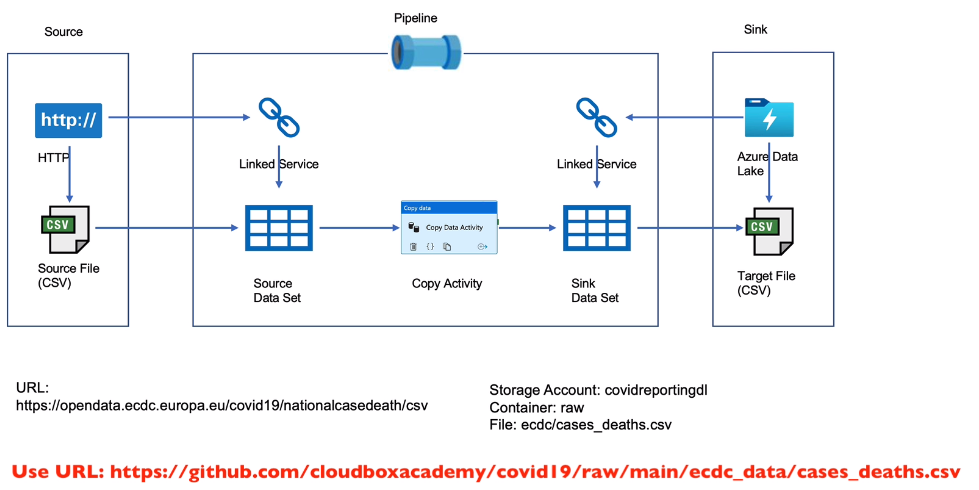
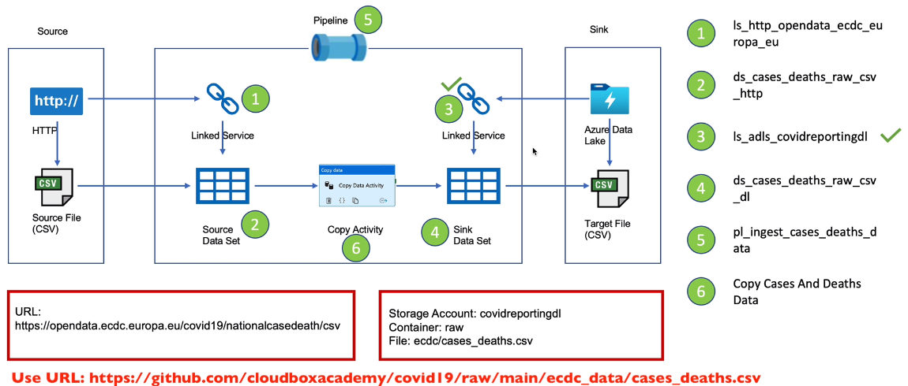

# Data Ingestion from HTTP

## Data Ingestion - ECDC Data

HTTP -> Azure Data Lake

## Create Pipeline
Copy Activity - Case and Deaths Data
- HTTP link service used instead of Azure Blob Storage
- Source file is CSV
- Target file is CSV

Build a Copy Activity that downloads the CSV file from the URL and copies the data across to the Data Lake

## Naming Standards

## Parameters and Variables
- Parameters are external values passed into pipelines, datasets or linked services. The value cannot be changed inside a pipeline
- Variables are internal values set inside a pipeline. The value can be changed inside the pipeline using Set Variable or Append Variable Activity (useful for iterating using variables)

## Pipeline variables
- For Source, parameterize
 the relative URL to pass in different values referring to the files to be copied
- For Sink, parameterize the file name so the dataset handles a different file for each call

## Pipeline parameter and Schedule Trigger
- Paramaterized file names and relative URLs within the data sets and used variables in the pipeline to test the copied datasets
- More dynamic method is to paramaterize the pipeline and change variables into parameters for the sourceRelativeURL and sinkFileName and pass these parameters using a Schedule Trigger
- Pipeline now takes parameters sourceRelativeURL and sinkFileName and copies the data from source URL to the Sink. This requires 4 triggers to copy four datasets.

# Control Flow Activity
- A more dynamic solution is to enable the pipeline to obtain source and sink information and copy the datasets, whilst invoking the pipeline through a single trigger.
- Use Lookup activity in Azure Data Factory - Lookup activity can retrieve a dataset from any of the data sources supported by data factory and Synapse pipelines. You can use it to dynamically determine which objects to operate on in a subsequent activity, instead of hard coding the object name.
- Use ForEach activity in Azure Data Factory - defines a repeating control flow in an Azure Data Factory or Synapse pipeline. This activity is used to iterate over a collection and executes specified activities in a loop (Use a database table or in this case a JSON object file containing sourceRelativeURLs and sinkFileNames in an array)
- The Lookup activity reads this data specified in the JSON file and the ForEach activity iterates through the lists in the array.
- Upload JSON config file to Azure Blob Storage container named config
- Now attach Lookup activity and ForEach activity to the pipeline and invoke copy activity within the ForEach activity in order to use sourceRelativeURLs and sinkFileNames as parameters for the copy Activity

## Linked Services Parameters
- We can parameterize a linked service and pass dynamic values at run time
- Parameter sourceBaseURL in pipeline, pass parameter to Source dataset, and then passed to Linked service
- Pipeline expects 3 parameters: sourceBaseURL, sourceRelativeURL, and sinkFileName, to copy data from HTTP source to Data Lake Storage

## Metadata Driven Pipeline
- Upload ECDC file list JSON file containing information of each dataset, to the Azure Blob Storage configs container
- Lookup activity on ECDC File list
- On Lookup success, use ForEach activity to execute copy for each record
- Execute copy activity in the ForEach activity
- Remove hard-coded parameters
- Add dynamic content. Within Copy Activity, set expression using ForEach iterator output followed by object names in JSON file. Set expressions for Source and Sink parameters
- Invoke Copy Activity dynamically with object values from the ECDC file list JSON

## Pipeline Ingest ECDC Data

- Create a Schedule trigger to ingest all ECDC data every 24 hours
- Attach trigger to the pipeline
- Monitor successful Trigger runs and Pipeline runs
- View copied data that is updated in the Data Lake Storage in Microsoft Azure Storage Explorer
