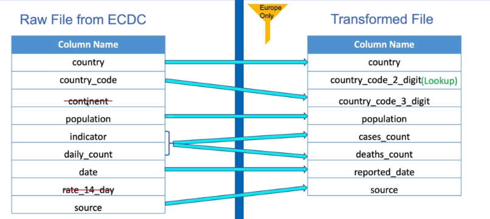
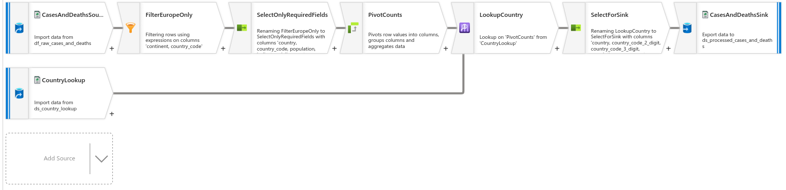
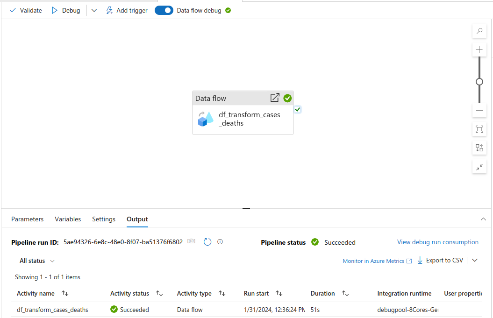
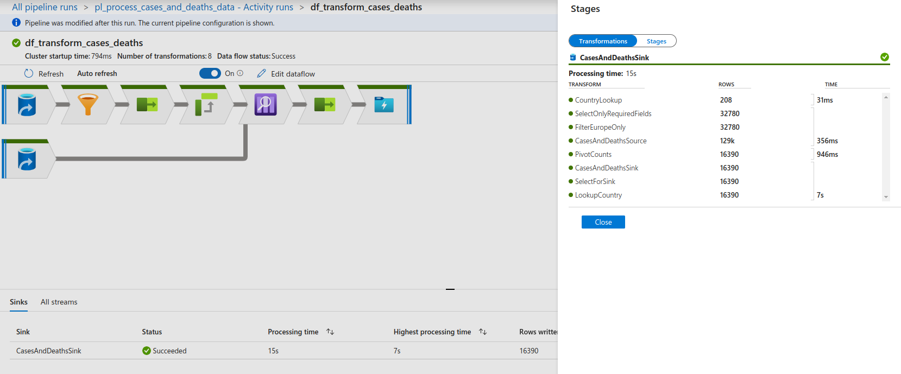
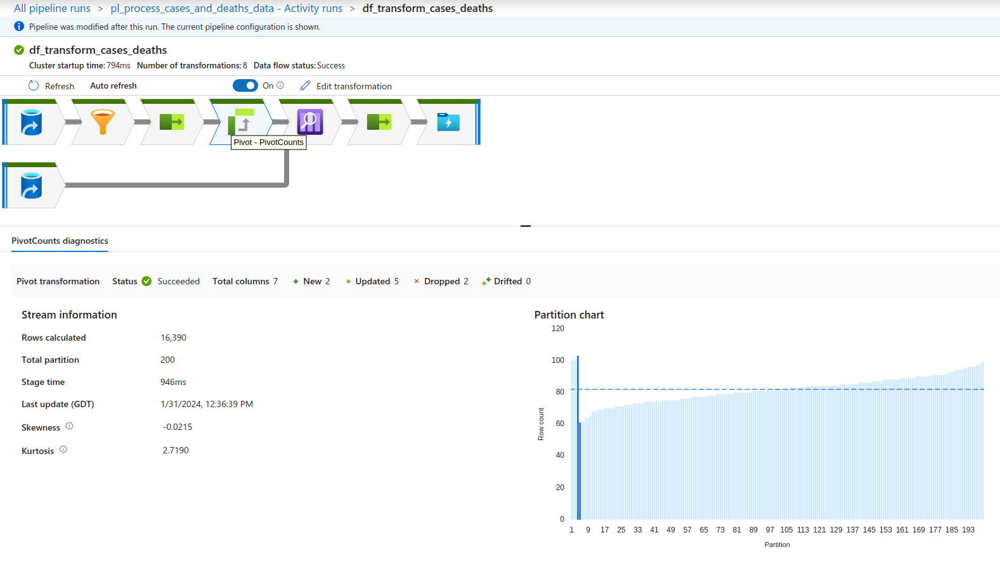

# Data Flows - Cases and Deaths Data Transformation

## Data Flows

- Code free data transformations
- Executed on Data Factory managed scaled-out Apache Spark clusters
- Benefits from Data factory scheduling and monitoring capabilities
- Data flow activities can be operationalized using existing Azure Data Factory scheduling, control, flow, and monitoring capabilities

Types:
- Data flow (mapping data flow ) - code free transformations at scale for fixed schema and known transformation logic upfront
- Wrangling Data Flow - code free data preparation at scale for visually exploring and preparing datasets

Limitations:
- Only available in some regions
- Limited set of connectors available
- Not suitable for very complex logic (complex design logic is difficult to maintain in Data factory, use Spark instead and execute using Data Factory)

Data Flow UI:
- Add Source to select dataset source
- Optimize is used for performance tuning and as Spark runs on distributed computing, partition options are crucial for performance.
- Use current partitioning means Data Factory will select the most suitable partition type based on the data source, however partition types can be set based on better understanding of the data
- Data Flow debug allows data preview as it flows through the Data Flow system (incurs charges due to use of Spark cluster)
- Transformations (joins, exists, lookup, union, etc), Schema modifiers (select, aggregate, surrogate key usually for fact/dimension models, pivot, windows etc), Raw modifiers (filter, sort, alter row), Destination (sink transformation)
- Data flows executed by building a pipeline and using Data Flow Activity
- Specify settings for Data Flow activities including clusters and integration run time and core count
- Specify any Parameters to be sent from pipeline to the Data Flow. For example, parameters sent from trigger to pipeline to data flow to allow parameters into our transformation actions
- Trigger or debug the pipeline and monitor

## Transform Cases and Deaths Data Requirements
- cases_deaths data file which is ingested into the data lake contains countries outside of Europe, filtering is required
- the country_code across files are 3 digit or 2 digit country codes or missing, therefore need to be standardised across files using a Lookup file to allow joins on country codes and various reporting queries.
- pivot the data based on the values in indicator and daily count columns to create confirmed cases and deaths column

## Transformations

#### Source Transformation
- Start Data Flow debug cluster
- Data set for source can be Dataset or Inline type in Source Settings
  - Deciding whether to use a Dataset or Inline relies on certain factors such as whether the type is supported by the source data type or whether the dataset will be used in other transformations and finally whether the dataset is understood well with a fixed schema (therefore use dataset) otherwise if data is unknown, use Inline
- For the created dataset options include:
  - allow schema drift
  - infer drifted column types
  - validate Schema
- Sampling enabled means random sample is selected by data factory for the data flows. For control over sample, create sample files of the data and specify the sample file and row limit in Debug settings
- In Source options can move, delete source files after completion or filter by last modified time
- In Projections can set data types for columns or detect data type and import projections

#### Filter Transformation
- Create filter transformation from incoming stream (source)
- Filter using Dataflow expression builder and use the Data preview to test expression
- Filter on columns continent and country_code to filter only data relating to Europe

#### Select Transformation
- Create Select Transformation to select only required fields
- Incoming stream is the Filter Transformation
- By default Dataflow maps every input to and output
  - auto mapping automatically maps columns to sink dataset - flows drifted columns and is useful for changing schemas and added columns
  - add mapping allows creation of new mappings (fixed and rule-based mappings by specifying an expression that evaluates to true or false and create separate fields based on this expression result)
  - skip duplicated input columns - join or lookup transformation where two sources have the same column, skip duplicated
  - skip duplicated output columns - if mapping results in the same output as a previous mapping, it is skipped
  - rule-based mappings - specify a mapping condition for input columns and output column names - prefix all input column names with cases to know the dataset source its coming from, or suffix all columns with data type string with string
- Delete continent column as all data is filtered already for Europe only
- Delete rate_14_day column
- Replace date by creating a rule-based mapping to change date to reported_date

#### Pivot Transformation
- Create Pivot transformation. for indicator and daily_count, pivot the daily_count into cases_count and deaths_count
- Pivot key is the indicator column, specify the values which are confirmed cases and deaths
- Pivoted columns is the PivotCount and pivot expression must be an aggregate function such as sum(daily_count). Reformat column name pattern as required
- Group by columns are the remaining columns, create a column for country + country_code that joins country and country code

#### Lookup Transformation
- Use Lookup transformation to get he country_code_2_digit column using the Lookup file uploaded to the storage account
- Create a dataset for the lookup file
- Create a Source transformation to import data from ds_country_lookup and set data types in Projections
- Create Lookup transformation which works similar to a Left Outer Join in a Join transformation. It takes the primary stream and performs left outer join to the Source for the Lookup data and outputs the joined results
- Lookup settings to specify primary stream and lookup steam along with lookup condition (avoid Cartesian product to prevent slow joins)
- Optimize allows Broadcast of data - Broadcasting is when you send small data frames to all nodes in the cluster. This allows for the Spark engine to perform a join without reshuffling the data in the large stream. Nodes should have enough memory and be memory-optimised nodes to fit the lookup data in every node for best performance
- Lookup transformation has provided the country_code_2_digit and country_code_3_digit columns as expected but also duplicated columns
- Use a Select transformation to select required columns and rename columns

#### Sink Transformation
- Sink Transformation can be used to write our transformed data to an output file
- Sink type must be a supported sink type so create a dataset instead of inline data set as we are outputting our data into a csv within data lake storage gen 2 so must create an adf data set within data factory
- Create a dataset for data lake gen 2 for the dataset
- Skip line count is the number of lines to be skipped from the stream before writing to the output sink
- Allow schema drift enables new columns incoming from source to flow through to Sink
- validate schema allows dataset schema for validation of schema
- Settings allow clearing the folder upfront to write the files or it will add new output files to the folder
- File name option - name file as column data to write to one file per country for example or can also output to single file (single stream, slow processing performance of data)
- Inspect and Preview the data and Validate for any errors
- Publish
- Note: Preview does not write any data to the sink as it is executed from a pipeline

#### Create ADF Pipeline
- Now the Data Flow is completed, create a pipeline to execute the data flow
- Create an ADF pipeline with a Data Flow activity and specify the data flow
- Specify compute size (and option to stage and ingest data into Azure Synapse Analytics)
- One pipeline can execute multiple data flows but a separate pipeline can be easier to run when required and test

- Data Flow Activity is used to executed the data flow

- Data flow has succeeded

- Data flow pivot details

#### Data Storage Explorer
- In the processed container, transformed data has been successfully output - data is distributed across nodes so files are split into 100+ files as work is processed in chunks

#### Triggerz
- Trigger now (manual trigger) to trigger pipeline now using last published configurations (Data flow debug not required to be started initially)
- Data Flow status will be AquiringCompute whilst it creating a spark cluster
- Pipeline is now completed and transformation is executed

#### Sink Transformation Settings
- Change sink transformation settings for File name option to Output to a single file
- Enter a file name which will contain all output content
- In Data Factory 'Output to single file' requires 'Single partition' to be the selected partition type
- Pipleine is now completed and execution completed. In processed container in the data lake gen 2 storage, all transformed data is written to one file as required
