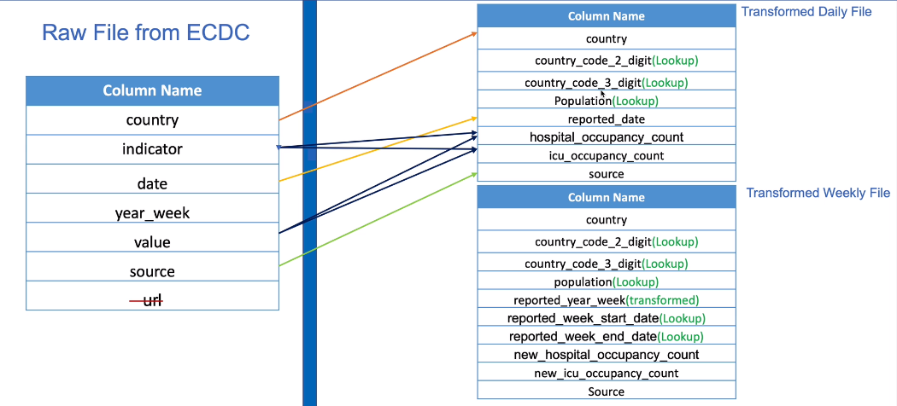
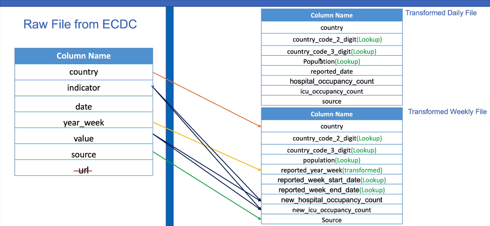
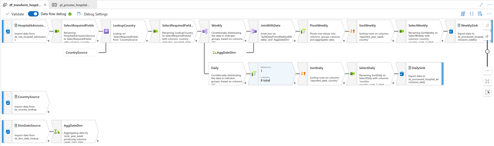
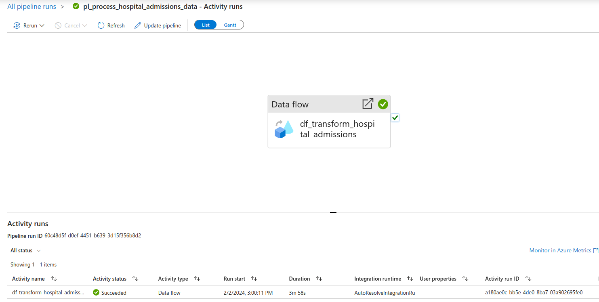
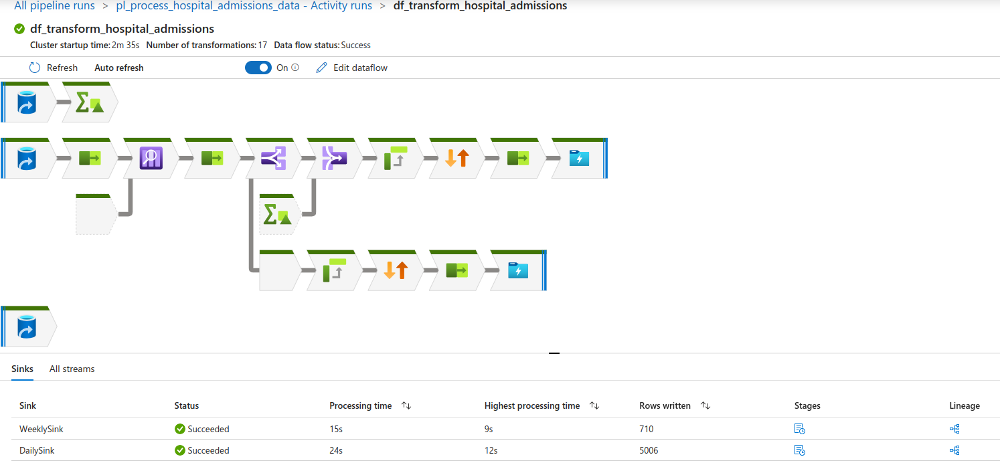

# Data Flows - Hospital Admissions Data Transformation

## Data Flow Activity
- Data flow activity for the transformation of the hospital admissions data which is ingested into the data lake storage gen 2. Data is transformed for reporting and data analysis purposes

## Transform Cases and Deaths Data Requirements
-  Transformation will result in 2 files:
    - Transformed Daily file
    - Transformed Weekly file

## Transformed Daily File

## Transformed Weekly File

#### Source Transformation
- Create a data flow for transforming hospital admissions data
- Create data set for Data lake storage gen 2 and select link service and file path to raw_admissions csv file
- Projections to detect data type and preview to view source transformation data

#### Select Transformation
- using the select transformation data mappings:
  - remove url
  - rename date to reported_date
  - rename year_week to reported_year_week

#### Lookup Transformation
- Perform lookup transformation using the country dimension file
- Create new source transformation with the country lookup dataset
- lookup transformation with lookup stream and lookup condition
- Select transformation to remove additional fields introduced by the lookup transformation
- Skip duplicated input and output columns

#### Conditional Split Transformation
- 4 indicators, 2 for daily and 2 for weekly
- transformation selects records relating to daily count into a separate stream and weekly count similarly (2 outputs from the data)
- set conditional split conditions for weekly and daily streams using expression builder
- rows that do not meet any condition will use the daily output stream

#### Source Transformation
- include week_start_date and week_end_date to weekly file using the dim date file
- year_week is in format 2020-W09 for year 2020 week 9
- use the corresponding record in the date dim file to obtain start and end week date
- derive one record for weekly data using min date and max date for the week (this can be joined to the hospital admission data)
- upload date dim lookup file to data lake and create source transformation with a new dataset with file path to data lake

#### Derived Column Transformation
- Derived column is used to transform data within a stream
- using year column and week_of_year column to derive a new column ecdc_year_week in format of 2020-W09 (this format allows easier joins using the ecdc data as it is in this format)
- create derived column transformation with new column and expression using year and lpad function for correct format of week

#### Aggregate Transformation
- transform data from date file to create one record per week which includes week start date and week end date with new derived week number column
- groupby column is the derived ecdc_year_week column
- aggregate includes week_start_date column with expression min(date) and week_end_date column with expression max(date)
- output of this stream is for each ecdc_year_week, week_start_date and week_end_date columns have been added
- the power of aggregate transformations mean the derived column logic can be done within the aggregate transformation using the expression builder (in this specific case, the stream is simplified by removing the derived column transformation)

#### Join Transformation
- Join data flowing through the hospital weekly stream with the dim date source stream
- This is required to push the week_start_date and week_end_date columns into the hospital weekly stream as required
- inner join on hospital weekly stream and aggregate date dim stream as every week record there exists a corresponding record in the dim date source
- inner join condition is reported_year_week equals ecdc_year_week
- Broadcast data to spark nodes so data is stored in memory making joins performance quicker (auto or fixed)
- output stream shows week_start_date, week_end_date and joins have worked correctly as reported_year_week matches ecdc_year_week for each record

#### Pivot Transformation
- Pivot transformation on both daily and weekly streams to get the hospital admission counts from the indicator and value fields
- Weekly file pivot:
  - Group by contains all columns to group by but uses reported_year_week as its the weekly stream pivot
  - Pivot key is the indicator with the weekly values
  - Pivoted columns is the count column which is the sum(value) and column name pattern uses the prefix pivot key value _ count
- Daily file pivot:
  - Group by contains all columns to group by but uses reported_date as its the daily stream pivot
  - Pivot key is the indicator with the daily values
  - Pivoted columns is the count column which is the sum(value) and column name pattern uses the prefix pivot key value _ count
- Data preview shows successful pivot transformations for both streams

#### Sort Transformation
- For hospital admission weekly stream, sort data on reported_year_week descending and country ascending to view most recent data for every country first
- Expression builder can be used to derive a new column
- For daily stream, sort data on reported_date descending and country ascending to view most recent data for every country first

#### Select and Sink Transformation
- For both weekly and daily hospital admission streams, select the fields to write to output file using select transformation, and rename columns as per the transformation requirements
- For both streams, create a sink transformation with a new data lake storage gen 2 data set with link service and path to precessed folder with folder to store output file (spark expects to write to folders due to partitioning)

#### Data Flow Execution using ADF Pipeline
- create ADF pipeline to execute the data flow using the data flow activity
- Specify the data flow and execute a manual trigger now to run the pipeline
- Data written to multiple files in the azure data lake gen 2 storage is beneficial in a distributed computing platform as data partitioned means data is distributed across several nodes and processed efficiently
- To write to a single file, set optimize settings to single data partition, clear the folder, and specify output to single file and file name
- Change sort transformations to single partition option to ensure the single file is sorted as expected

- Data Flow Activity is used to executed the data flow

- Data flow has succeeded

#### Triggers
- Trigger now (manual trigger) to trigger pipeline now using last published configurations (Data flow debug not required to be started initially)
- Data Flow status will be AquiringCompute whilst it creating a spark cluster
- Pipeline is now completed and transformation is executed

#### Data Storage Explorer
- In the processed container, transformed data has been successfully output.
  - hospital_admissions_weekly and hospital_admissions_daily folders
  - transformed csv files for sorted weekly and daily data flow streams
