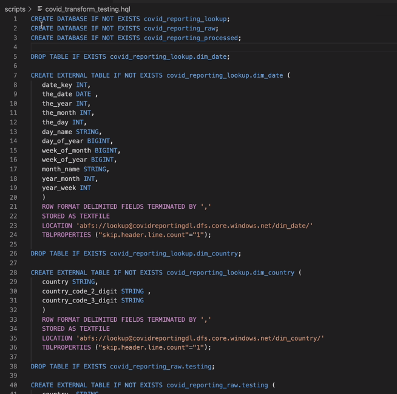
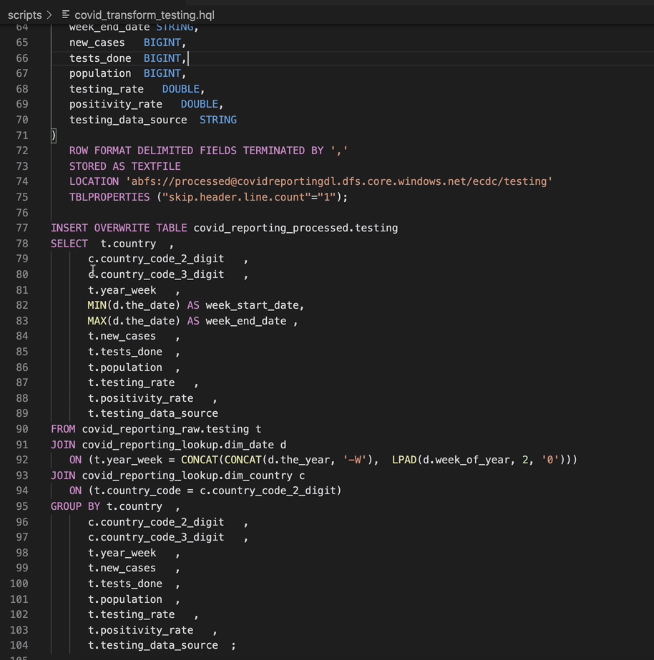
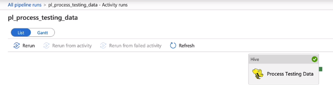
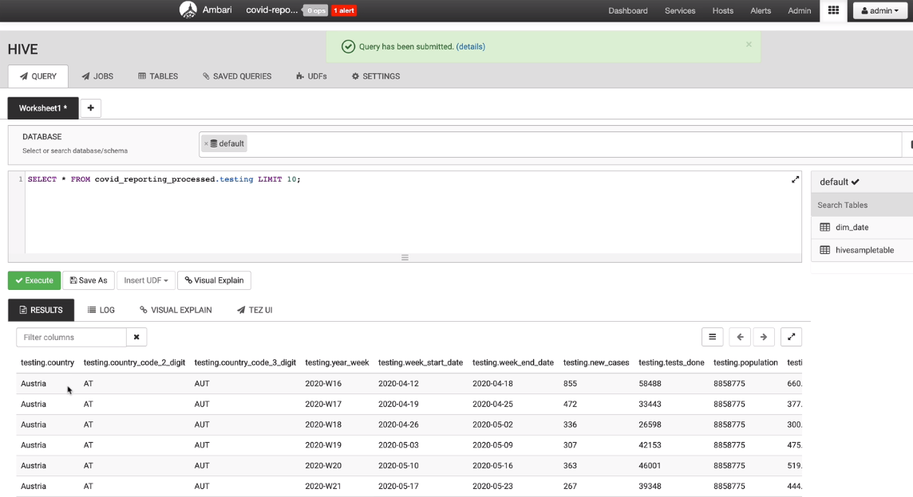

# HDInsight Activity
Azure HDInsight is a managed cluster platform that makes it easy to run big data frameworks like Apache Spark, Apache Hive, LLAP, Apache Kafka, Apache Hadoop, and others in your Azure environment. It's designed to handle large volumes of data with high speed and efficiency

## HDInsight Activity - Testing File
- creating HDInsight Cluster
- Transformation Requirement
- Hive Script
- Creating Pipeline
- Deleting HDInsight Cluster

## Creating HDInsight Cluster
- HDInsight Cluster to access azure blob storage account (raw data) and data lake gen2 account (transformed data) - Accessed via a managed identity
- Create user assigned managed identity
- Grant access to data lake gen2 storage by adding role assignment of Storage Blob Data Owner
- Create HDInsight cluster, assign data lake gen2 and blob storage accounts, set managed identity, configure head node, worker nodes, and zookeeper nodes, deploy cluster

## HDInsight UI
- IAM for entity management and access control
- Cluster size configurations and enable autoscale
- SSH + Cluster log in
- Storage accounts - account storage and azure data lake storage gen2 attached
- Ambari - Apache Ambari simplifies the management and monitoring of an Apache Hadoop cluster. This simplification is done by providing an easy to use web UI and REST API
- Hive View -  The Hive View allows you to author, optimize, and run Hive queries
- Tools to connect to Hive database include SQuirrel and DbVisualizer

## Transformation Requirement - Testing Data
- Testing data requires country_code lookup transformation and year_week lookup transformation to obtain week_start_date and week_end_date

## Hive Script - Transform Testing Data
- Hive script to transform testing data
- create 3 databases to store raw data tables, processed data tables, and lookup data tables

- process and insert data into processed data database tables
- insert statements from raw tables and joining with the lookup tables (dim_date and dim_country)
- group by to obtain min and max for weekly dates as required
- upload hive script to storage account

## ADF Pipeline with Hive Activity
- create ADF pipeline with Hive activity
- new HDInsight linked service using Bring your own HDInsight or on-demand HDInsight
- select hdi cluster and provide credentials
- specify script linked service (storage account ls) and file path to hive data transformation script
- Manual Trigger now to run pipeline
- view activity run details and stderr file for output of processes (execution results and rows produced) and errors

## Ambari - Query processed data using Hive View Querying

## HDInsight Activities
- Hive activity
- Pig activity
- MapReduce activity
- Spark activity
- Streaming Activity

## Delete HDInsight cluster
- Use HDInsight as big data processing engine and integrate data from various sources to Azure Data Factory for processing
- Locate hdi cluster in Azure account and Delete cluster to stop incurring charges
