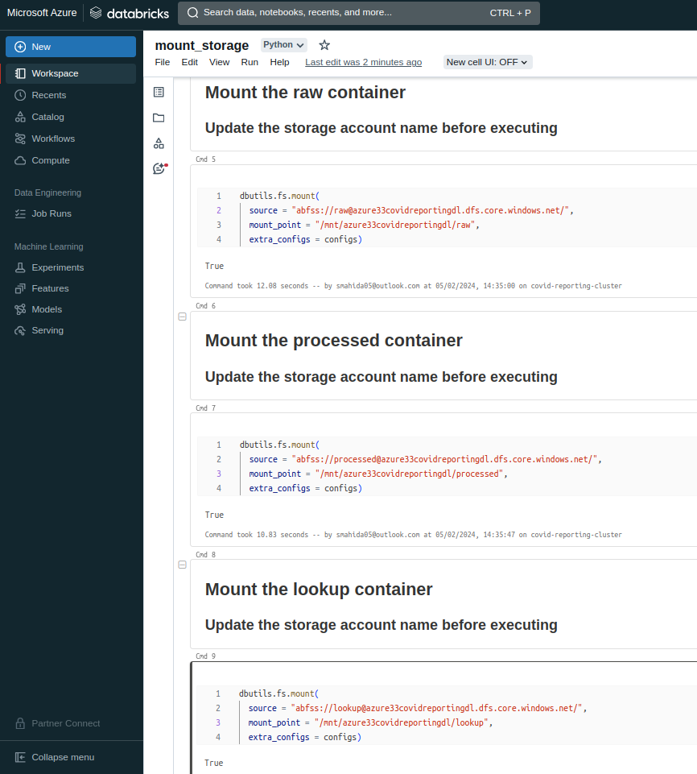
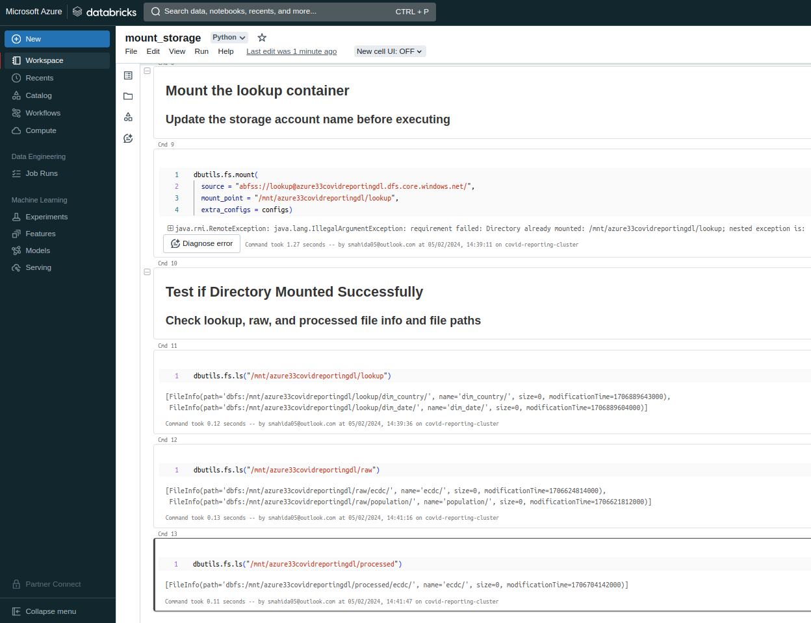
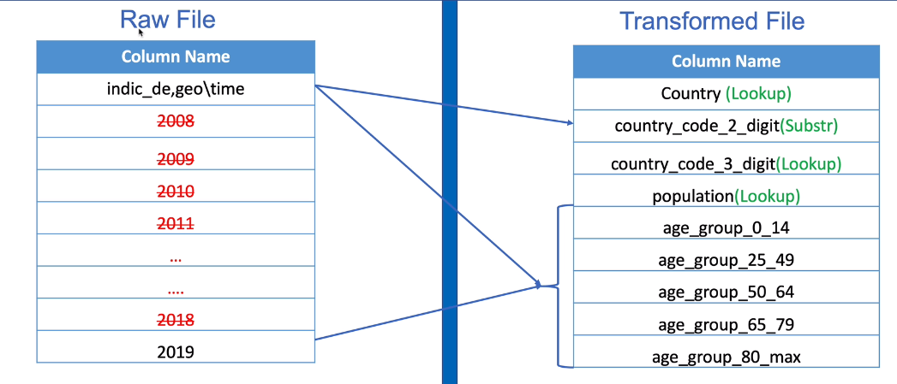

# Databricks Activity
Azure Databricks is structured to enable secure cross-functional team collaboration while keeping a significant amount of backend services managed by Azure Databricks so you can stay focused on your data science, data analytics, and data engineering tasks

Azure Databricks operates out of a control plane and a compute plane.
- The control plane includes the backend services that Azure Databricks manages in your Azure Databricks account. Notebook commands and many other workspace configurations are stored in the control plane and encrypted at rest.
- The compute plane is where your data is processed.

## Databricks Activity - Population File
- Create Databricks Service
- Create Databricks Cluster
- Mount storage accounts
- Transformation Requirements
- Create pipeline

## Create Azure Databricks Service
- Create Azure Databricks workspace and Launch workspace
- create notebooks in workspace user directory, admin console, create compute/clusters, jobs (data engineering) to schedule workloads within Databricks but we use data factory to invoke jobs, models/experiments (Machine Learning) for ml workloads

## Create Azure Databricks cluster
-  An Azure Databricks cluster is a set of computation resources and configurations on which we can run workloads such as ETL pipleines or ML experiments
- A cluster consists of one driver node and zero or more worker nodes. You can pick separate cloud provider instance types for the driver and worker nodes
- Types of clusters
  - All-Purpose compute: Used to analyse data collaboratively using an interactive notebook. You can create, terminate, and restart this compute using the UI, CLI, or REST API.
  - Job compute: Used to run fast and robust automated jobs. The Azure Databricks job scheduler creates a job compute when you run a job on a new compute. The compute terminates when the job is complete. You cannot restart a job compute
  - Instance pools: Compute with idle, ready-to-use instances, used to reduce start and autoscaling times
  - Serverless SQL warehouses: On-demand elastic compute used to run SQL commands on data objects in the SQL editor or interactive notebooks.
  - Classic SQL warehouses: Provisioned compute used to run SQL commands on data objects in the SQL editor or interactive notebooks.
- Start an All-Purpose compute cluster and specify cluster mode, runtime version, and node type (general purpose, memory optimised, compute optimised, storage optimised, confidential, or GPU accelerated)

## Mounting Data Lake Storage (Python)
- Create Azure Service Principal
- Grant access for data lake to Azure Service Principal
- Create the mount in Databricks using Service Principal
- Therefore the Databricks workdpace will have the same permissions as the Service principal to access the storage account
- Microsoft Entra ID App registrations to create new registration
- Copy Application (client) ID, Directory (tenant) ID, and Secret Value
- Grant access for data lake to service principal
- In data lake resource, IAM, add role assignment as storage blob data contributor and grant access to the app
- Mount storage in Databricks by creating mount_storage.py set-up python script (notebook)
- Enter Application (client) ID, Directory (tenant) ID, and Secret Value (best practice - use key vault secret)
- Execute set-up script Daabricks notebook and test if all raw, processed, and lookup containers are successfully mounted

- Mount the raw, processed, and lookup containers

- Test if containers from Azure Storage mounted successfully

## Transformation Requirement - Transform Population By Age Data (Python)
- drop all data except for 2019 which is required for this project
- substring to obtain country_code_2_digit from raw column
- lookup to obtain country, country_code_3_digit, and Population
- pivot using the age group and value to create a column for each age group for each country rather than having a new record for each age group

#### Transformations
- Split the country code & age group
- Exclude all data other than 2019
- Remove non numeric data from percentage
- Pivot the data by age group
- Join to dim_country to get the country, 3 digit country code and the total population.

## Azure Databricks - Python Notebook to Transform Population by Age data by performing the transformations above
- import sql functions
- read population data from raw population folder using new mount
- split the age group and country code to obtain year groups
- drop columns other than 2019
- create a temp view
- use pivot function to pivot data and create a temp view on the pivot called raw_population_pivot
- read the country lookup data and store as temp view called dim_country
- join pivot temporary view and lookup temporary view to obtain country codes and population data
- processed population dataframe to create the final table and provide alias to column names
- write output to the processed mount point

## ADF pipeline - Databricks Notebook Activity
- Execute databricks notebook from Azure Data Factory using ADF pipeline with Databricks notebook activity to transform Population by age data
- In ADF, create a new linked service (compute) for Databricks cluster and select Databricks workspace, authenticate using access token generated from Databricks, configure cluster, select new job cluster for Azure to spin up a cluster or Existing interactive cluster to use Databricks cluster, specify worker nodes, and python version 3
- Create ADF Pipeline to process population data by creating a Databricks Notebook Activity, specify Databricks linked service, and  Notebook Path

- Python notebook to transform population data has been successfully executed and transformed files written to the data lake storage account
- View job run in Databricks workflows and inspect task run details

## Databricks Activities
- Notebook
- Python
- Jar
