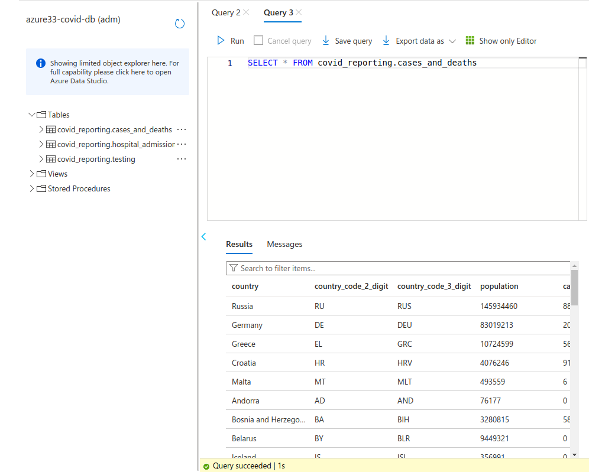
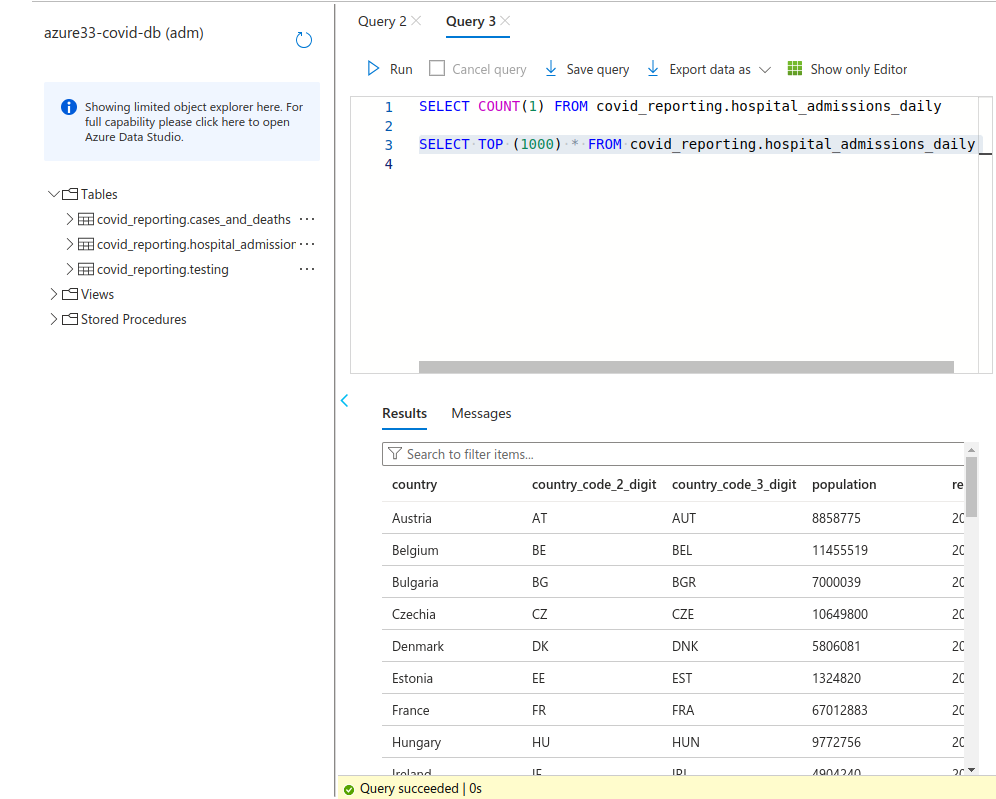
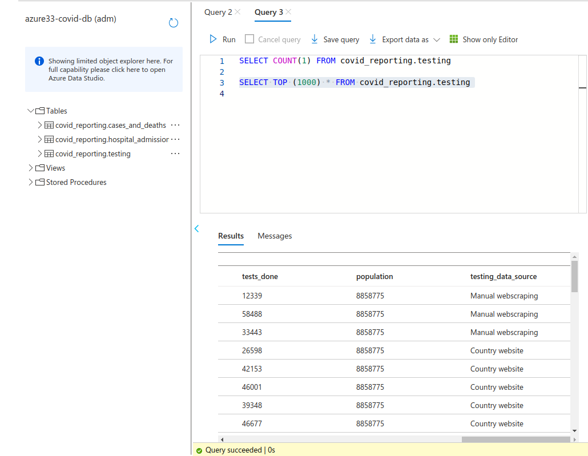

# Copy Data to Azure SQL

## Copy Data to Azure SQL Database for Reporting From Power BI - Data Visualization
- Copy Cases and Deaths
- Copy Hospital Admissions
- Copy Testing

## Copy Activity - Data Lake to SQL - Cases and Deaths Data
- Create tables ddl in SQL db

- create ADF pipeline with Copy data activity
- source dataset is the processed cases and deaths dataset (wildcard path required)
- create new linked service for sql db
- sink dataset as azure sql database, sql script is used to create tables rather than auto create table, pre-copy script is TRUNCATE TABLE prior to loading data to avoid duplicated data on refresh
- Debug to run pipeline - data copied from Azure data lake storage gen2 to Azure SQL database
- No mapping required as source and sink are of the same structure

## Copy Activity - Data Lake to SQL - Hospital Admissions Daily Data
- create ADF pipeline with Copy data activity
- source data set is the processed hospital admissions daily data (wildcard path required to access files within a folder)
- sink dataset as azure sql dataset with linked service for sql db, pre-copy script is TRUNCATE TABLE
- Debug to run pipeline - data copied from Azure data lake storage gen2 to Azure SQL database
- No mapping required as source and sink are of the same structure
- Query sql database to view the data, running pipeline again displays same number of records showing pre-copy script works correctly

## Copy Activity - Data Lake to SQL - Testing Data
- structure of data in data lake and structure of data in sql database are different
  - testing data was created using hive script
  - data file has no headers
  - testing_rate and positivity_rate columns are not required in the db for reporting but exist in the data lake file
- create ADF pipeline with Copy data activity that maps data lake data to sql db database to ingest the data as expected
- create source dataset for processed testing data as azure data lake gen2
- create sink dataset as sql database and schema shows the columns we want to copy
- create ADF pipeline with Copy data activity
- specify source dataset with wildcard path to access files within folder
- specify sink dataset with pre-copy script is TRUNCATE TABLE
- Mapping is required - import schema and set mappings between columns (set data types/schema in dataset)
- Debug to run pipeline - data copied from Azure data lake storage gen2 to Azure SQL database with correct mappings

